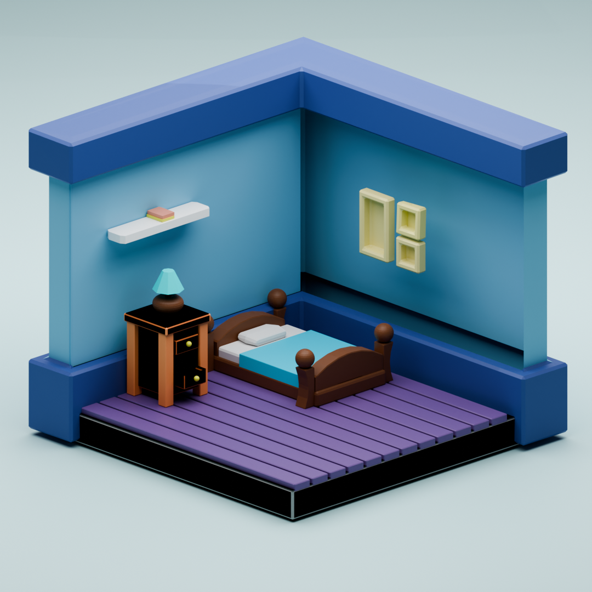

# Blender_Isometric_Room

A stylized isometric room created in **Blender** as a 3D modeling and rendering project. This project explores isometric design principles, lighting, materials, and scene composition to create a visually appealing interior.

## 📸 Preview



## ✨ Features

- 🛋️ Stylized isometric room design
- 🎨 Custom materials and textures
- 💡 Thoughtfully arranged lighting
- 🧱 Low-poly aesthetic with clean geometry
- 📷 Rendered using Blender

## 🛠️ Built With

- **Blender** – 3D modeling, materials, lighting, and rendering

## 📂 Project Structure

```
├── README.md
├── room.blend
├── room.png
├── solid view.png
└── wireframe.png
```

## 🚀 Getting Started

1. Clone this repository:
   ```bash
   git clone https://github.com/shreya-2703/Blender_Isometric_Room.git
   ```
2. Open the `.blend` file in Blender.
3. Explore the scene or render it using your preferred settings.

## 📌 Purpose

This project was created to practice:
- 3D modeling
- Lighting techniques
- Camera placement
- Isometric art style in Blender

## 🤝 Contributions

Suggestions and feedback are welcome. Feel free to fork the repository or open an issue.
